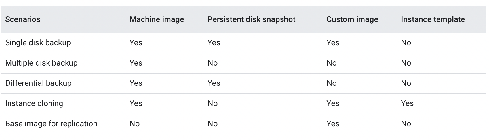

One/more Block -> One instance

One block storage can only be assigned to one instance.

DAS - Direct Attached Storage
SAN - Storage Area Network - group of storage with high speed network

```
gcloud compute disks
```

GCP: 
- _Persistent Disk_ Zonal/Regional, (high durability)
    - can alter storage - scale when needed
    - high storage -> high performance
    - Regional -> replica in 2 zones, 2x cost than zonal
    - usecase: custom dbs (not managed service)
- Local SSDs 
    - disk physically attached to vms directly 
    - data lost when VM goes down 
    - only available in few instance types
    - can't configure encryption(managed by GCP)
    - SCSI or NVMe interfaces - used to attach to VMs
    - more mem on disk/more cpu in VM - better performance
    - cannot attach/detach to another instance
    - usecase: high iops, temp data, -> cache,scratch files etc
    - snapshots are not supported
---

File storage can be used by many instances
GCP: FileStore - high performance

Attach the filestore to Instances - using ssh

---

PD (Persistent Disk) ordered cost wise cheapest to costliest
- Standard (hdd) - good for sequential iops (big data/batch - and cost efficient) - not good for transactional data (random iops)
- balanced (ssd) - good for both big data and transactional data
- SSD - expensive, high performance


---
Snapshots
- can be multi regional / regional
- can take point in time snapshots
- they are incremental
- can schedule snapshots - with auto deletion for old ones
- can create new instances/disks from the snapshots
- can be shared to other projects

- when snapshots are taken - reduces the performance of the disk - schedule on off hours - dont take often

- creating disk from from image is faster than snapshots


when deleting a snapshot, the data which is not required/on the other snapshots (versions) are only deleted
- deleting old snapshots does not mean deleting all data initially present
- delete snapshots with data not required - to save space

----
Machine image is created from VM (image is created from disk)

Machine image has total info on VM, like how many disks it has, permissions/metadata, configurations


Used for - instance cloning, disk backups, replication



differential backup means incremental backup